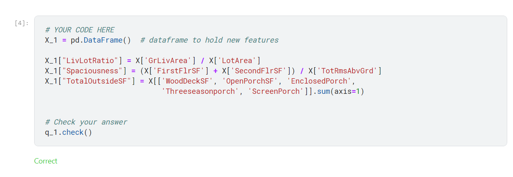

He realizado el curso completando satisfactoriamente a continuacion muestro las imagenes del curso:

### IMAGENES DE PRUEBA:

### TODO EL CURSO ESTA EN LA CARPETA DE [notebooks](C:\Users\victo\kaggle-courses\feature_engineering\notebooks) con analisis de cada uno de los ejercicios

### IMAGEN DE MI CERTIFICADO DE HABER CULMINADO EL CURSO DE FEATURE-ENGINNEERING DE KAGEL

